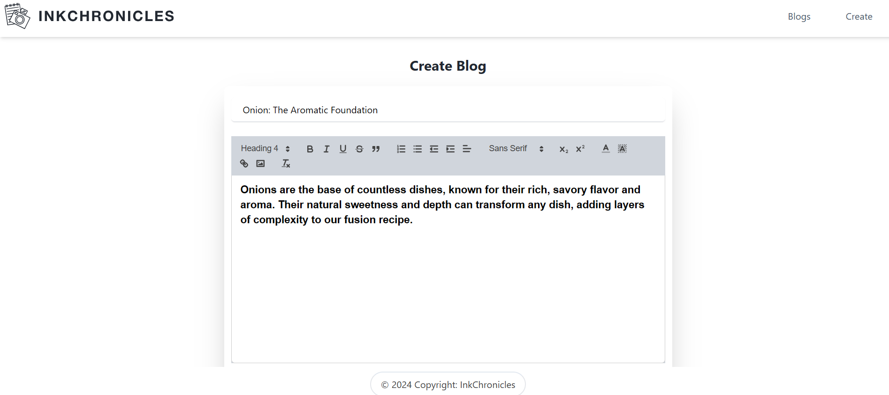
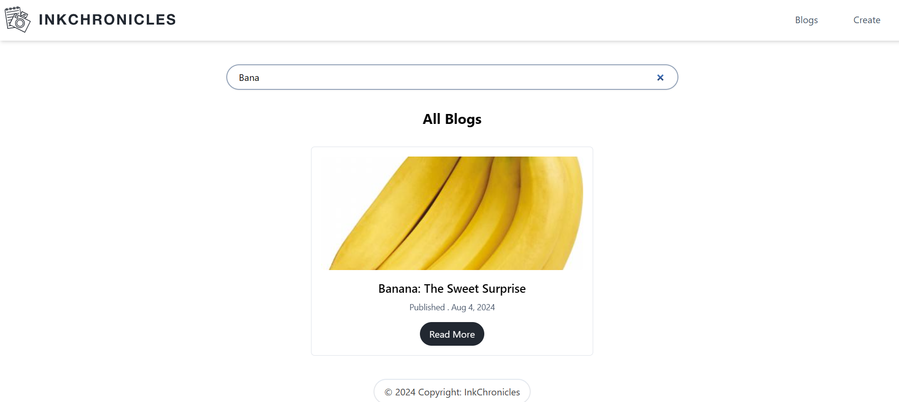
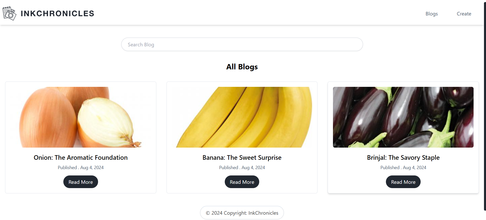

# MERN Blog Creator 📝

**MERN Blog Creator** is a full-stack blogging application designed to provide users with a seamless experience in creating, editing, and managing blog posts. Built with the MERN stack and MySQL, the app features a robust backend and a modern, responsive frontend.

## Features ✨

- **Create Blogs**: Utilize the rich text editor to craft content and enhance your posts with image uploads.
- **Search Blogs**: Easily search through blog titles to find what you're looking for.
- **View Blogs**: Browse through the list of all published blogs.
- **Detailed Blog Views**: Click on a blog to read its full content in detail.

## Screenshots 📸

### Create Blog



### Search Blogs



### View Blogs



### Detailed Blog View


## Getting Started 🚀

### Prerequisites

- Node.js
- npm
- MySQL

### Installation

1. Clone the repository:
   ```bash
   git clone https://github.com/Abdur-Rehman-643/MERN-Blog-Creator.git
   ```
